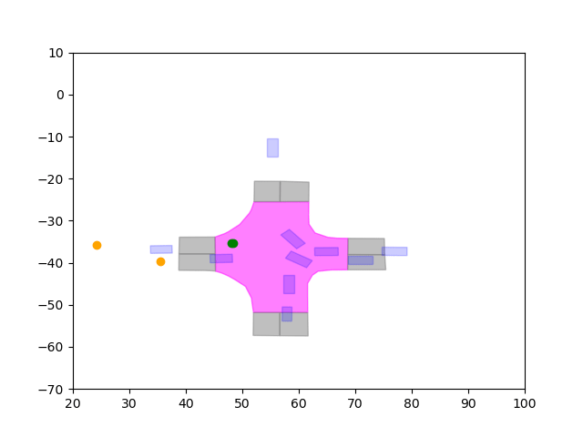

# Beyond the Data Imbalance: Employing the Heterogeneous Datasets for Vehicle Maneuver.

This page contains the drone dataset used in our paper

[**Paper**](paperlink)
│ [**Documentation**](https://github.com/KAIST-VDCLab/VDC-Trajectory-Dataset/tree/master/docs)
│ [**Download**](https://github.com/KAIST-VDCLab/VDC-Trajectory-Dataset/releases)
│ [**Tutorials**](example.ipynb)

## Contents
1. [Overview](#overview)
2. [Getting Started](#getting-started)
3. [Dataset Information](#dataset-information)
## Overview

<div align="center">

</div>

This is the drone dataset captured over several intersections in Daejeon, South Korea. The dataset contains two directories: ```raw``` contains the trajectory data for the tracked objects in the intersection, while ```processed``` contains the processed information from the raw data used to train the model in our paper. 

## Getting Started


### Download

You can download the dataset from the [releases](https://github.com/itsbman/drone_dataset/releases) page. Extract the zip files and make sure the dataset directory structure is as follows:

```
data_root
├── processed
│   ├── conversion
│   ├── link_idx
│   ├── maneuver_index
│   ├── nearest_outlet_state
│   ├── outlet_node_state
│   ├── total_traj
│   ├── plots
│   └── folder_tree
└── raw
    ├── background
    ├── landmark
    ├── mapSegmentation
    ├── recordingMeta
    ├── segmentation
    ├── tracks
    └── tracksMeta
```

### Examples

Please take a look at the [example notebook](https://github.com/itsbman/drone_dataset/blob/master/example.ipynb) on how to use the information contained in the dataset.

## Dataset Information

### Statistics

- No. of tracked objects at each intersection

| Intersection Id | Cars| Pedestrian | Bicycle |
| :---: | :---: | :---: | :---: |
| 1 | 788 | 135 | 46 |
| 3 | 71 | 0 | 1 |
| 4 | 184 | 0 | 5 |
| 5 | 110 | 105 | 8 |
| 6 | 77| 90 | 4 |

- No. of trajectories for each class

| Cars | Pedestrian | Bicycle |
| :---: | :---: | :---: |
| 10,555 | 4,353 | 571 |

$*$ Trajectory: 5 second long for 10hz interval.

<!-- | Dataset | Location | Trajectory Counts | Location Counts | Included | FPS | Method
| :---: | :---: | :---: | :---: | :---: | : ---: | : ---: | 
| 1 | 788 | 135 | 46 |
| 3 | 71 | 0 | 1 |
| 4 | 184 | 0 | 5 |
| 5 | 110 | 105 | 8 |
| 6 | 77| 90 | 4 | -->

## Cite

If you find this drone dataset or our paper helpful for your own research, please consider citing:

```
@inproceedings{Beyond2024Jeon,
  title={Beyond the Data Imbalance: Employing the Heterogeneous Datasets for Vehicle Maneuver Prediction},
  author={Hyeongseok Jeon, Sanmin Kim, Abi Rahman Syamil, Junsoo Kim and Dongsuk Kum},
  booktitle={Proceedings of the European Conference on Computer Vision},
  year={2024}
}
```
